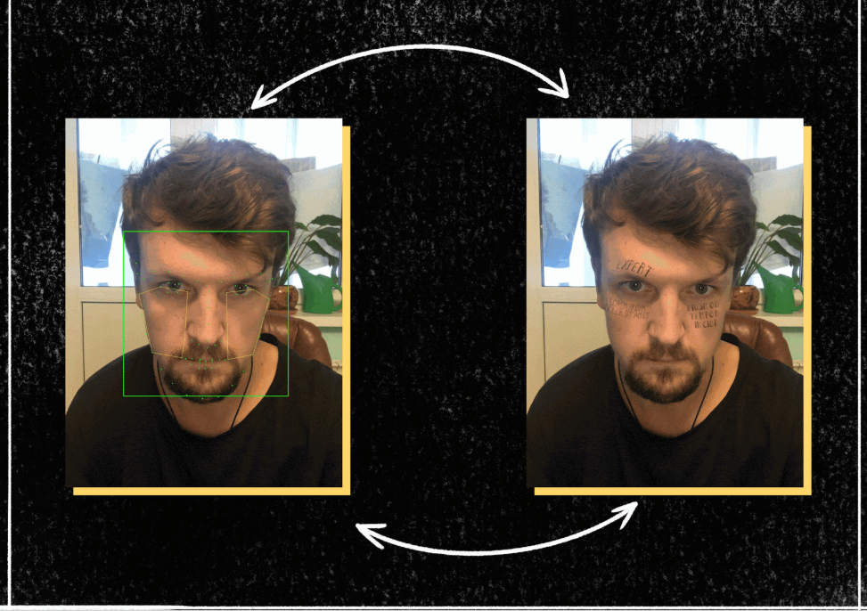
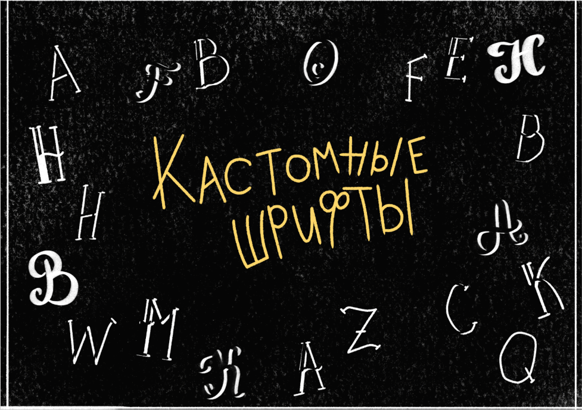
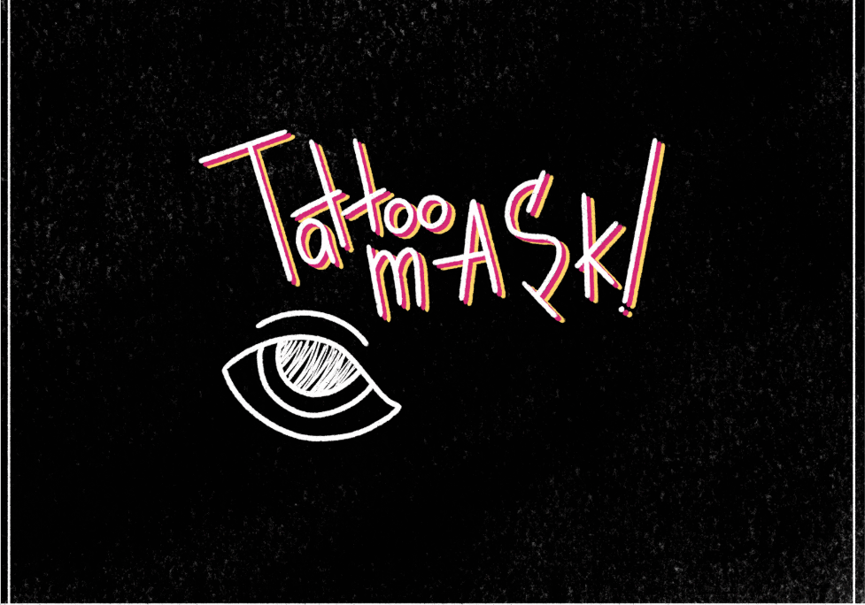

# Tattoo Mask
Want to see yourself with tattoo? 

## Built With

* [OpenCV](https://opencv.org/) - Framework for computer vision
* [dlib](http://dlib.net/) - Machine learning toolkit
* [Caffe](https://caffe.berkeleyvision.org/) - Deep learning framework
* Passion for computer vision

## How to use? Type text, add photo and it will add it automaticly

### Detects face, facial landmarks and extracts polygons for tattoo

### Uses our own fonts

### Text deformation will be provived soon...

